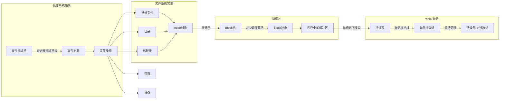

# File System

## 缓冲
xv6的文件系统有block缓冲，inode缓冲，这些缓冲是从磁盘读取到内存后形成的结构
读取到内存后，会增加一些额外的信息，例如自旋锁，引用计数等
## 多级索引
  
为了简洁，xv6使用了二级索引来存储文件数据所在的磁盘块号。一个inode中有12个直接索引，一个间接索引。
支持的文件大小为268KB
## inode
inode存储文件的元数据，xv6仔细设计了inode的结构使得大小刚好为64字节，这样一个磁盘块刚好能够存储16个inode
## 锁
block和inode都有睡眠锁保护。在操作block和inode的字段时，都需要先获取锁
## Large files
xv6只有一个二级索引，文件最大只能存储268KB。增加一个三级索引以支持更大的文件
### 过程
修改`bmap`，依次读取索引表，查表，完成三级索引的查找功能  
修改`itrunc`，遍历三级索引表，释放索引指向的磁盘块，以及索引表占用的磁盘块
## Symbolic links
增加一个系统调用`symlink(char *target, char *path)`，实现软连接的功能，增加一个宏`O_NOFOLLOW`
能够直接打开软链接文件
### 测试要求
根据Linux实现的软链接的特性，需要检查以下几点
- a -> b时，打开a，相当于打开b
- a -> b时，可以删除b，后续a会失效
- a -> b -> a时，产生循环链接，需要检测出来
- 可以规定软链接的最大深度
- 当不存在b时，a -> b可以创建，但无法打开  

测试流程的shell表示
```shell
echo "hello" > a
ln -s a b
cat b   # 测试点1

rm a    # 删除链接目标文件后，b还在但是无法打开，成为了broken link
cat b   # 测试点2

rm a b    # 循环链接（链接深度超过限制）
ln -s b a
ln -s a b   # 测试点3

rm a b    # a不存在
ln -s a b   # 测试点4
```
### 实现思路
1. 添加一种新的文件类型`T_SYMLINK`，在inode中存放一个字符串指向目标文件，路径最大长度为128字节  
    这种方式能够支持相对路径的链接，也能够支持链接目录，也能够链接到一个不存在的文件。还能持久化到文件系统
2. 打开文件时，根据打开标志位`O_NOFOLLOW`，决定是否要将文件路径重定向到目标文件
### 实现细节
1. 判断一个文件类型是否为`T_SYMLINK`时，需要先获取inode
2. `inode`的`type`字段被睡眠锁保护，必须拿锁再判断
3. xv6规定所有文件系统调用都要在`op_begin`和`op_end`之间，以实现日志功能
4. 判断是否超过最大链接深度时，需要在打开文件时进行。而创建软链接时不对链接目标做任何检查

## 软链接与压缩文件
linux的`zip`命令创建压缩包时，如果遇到了软链接，会将软链接的目标文件打包进压缩包中  
根据man手册，`zip`命令的`-y`或`--symlinks`选项可以设置保存软链接文件本身  
与`zip`配套的`unzip`命令能够在解压时恢复软链接  

然而，zip格式是跨平台的格式，这也就意味着zip命令能保存软链接是通过zip格式的私有扩展实现的  
所以有软链接的压缩包有可能出现无法恢复出软链接的情况，这时原来的软链接就会变成一个存储着目标文件路径的普通文件  
这为我们提供了一个思路，软链接可能就是存储了目标文件的路径的特殊文件  

另外，通过`ls`命令查看软链接文件的大小，刚好和链接目标的路径长度相同，这也证明了上述猜想