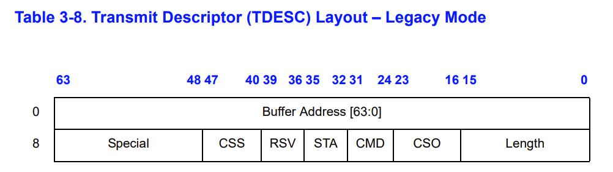

# network driver
xv6加入了网络功能，补全`e1000_recv`和`e1000_transmit`函数，实现将以太网帧的数据交付给网卡，以及从网卡获取以太网帧的数据的功能
## DMA
E1000具有使用DMA传输数据的能力，传输数据时，只需要告知E1000，然后E1000就会开始工作  
E1000可以通过突发抢占总线的方式与内存交互  
收到包时，E1000会发送中断告知CPU，随后中断处理程序开始工作
## Memery mapped IO
qemu将E1000的寄存器映射到物理地址的低位，所以可以直接用C语言操作寄存器
## Ring
E1000使用了一个接收缓冲队列和一个发送缓冲队列。缓冲队列在内存中。控制队列所需的head，tail等变量都由E1000的寄存器保存  
缓冲队列是基于数组实现的

### Descriptor
缓冲队列中存放的是描述符，描述符是一种16字节的比特数组  

### 单生产者单消费者的环形队列是线程安全的(lock free)
E1000与驱动程序共享缓冲队列而不必考虑线程安全

## E1000的其他高级特性
- 支持自动校验IP，TCP，UDP报文
- 缓冲队列由软件配置，灵活性高
- 具有三种中断，在大量包短时间到达时能够减少发出中断的次数
- 支持VLAN
- 具有为TCP优化过的发送模式