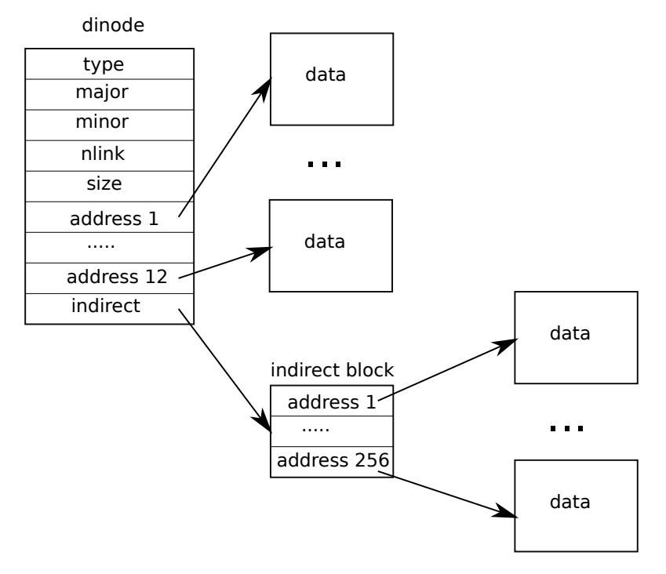

# Lock
## 自旋次数
本实验的自旋锁中具有记录自旋次数的功能，用来衡量并发性能。

## 获取CPU的id
riscv只允许在M模式获取hartid(hardware thread id)。xv6通过一些技巧来绕过了这个限制。  
基于两个事实
1. 每个CPU的寄存器是独立的
2. C语言编译产生的代码不会使用tp寄存器

在操作系统启动的初期，xv6运行在M模式下，这时它将hartid保存在tp寄存器中。随后要获取hartid时只需要读取tp  
通过这种方式，xv6可以在S模式下获取hartid。
## 自旋锁保护Invariants
Invariants指的是不变量。例如链表的Invariants是每一个元素的next指针都指向下一个元素。例如哈希表中的每一个entry的key都是唯一的  
然而，在操作数据结构时，一定存在这样的时刻，Invariants不成立。如果在Invariants不成立的时刻进行其他操作，就会导致数据结构的破坏
锁的用途就是保护Invairants。在锁保护的区域内，需要完成的工作是恢复Invariants。锁释放后，Invariants成立。
---
也可以认为，数据结构是一种状态机，每一个状态都是Invariants成立的状态。而Invariants不成立的时刻可以认为是在状态转换中出现的**中间态或者非稳态**  
相应的，Invariants成立的状态可以认为是**稳态**  
数据结构发生状态的转变时，只能从稳态开始转变，到达另一个稳态。  
状态转移的过程就是先破坏Invariants，然后恢复Invariants。这个过程由锁保护
## 锁的re-entrant
为了简单，xv6使用的锁是不可重入(re-entrant)的锁
## 中断处理程序与内核共享数据
xv6中的自旋锁保护的资源中，有一些是内核与中断处理程序共享的，例如`ticks`(记录时间中断的次数，相当于相对时间)  
xv6响应中断时会关闭中断，如果在一个系统调用中，获取了自旋锁，然后发生了中断，中断处理函数尝试获取同一个锁，就会发生死锁。    
为了解决以上的问题，xv6规定**内核在持有自旋锁时需要关闭中断**，当所有锁都释放后才能开启中断  
xv6引入了`push_off`和`pop_off`机制来实现了记录**锁的深度**的功能。当锁的深度为0时恢复中断。  
## 持有自旋锁时不可以睡眠
因为xv6实现的自旋锁是先关闭中断再自旋。当持有自旋锁的CPU睡眠后，如果被调度的进程尝试获取同一个自旋锁，可能发生死锁。  
（因为中断已经关闭了，内核不会让出CPU，进程将永远自旋，主要是在单CPU的情况下）  
此外因为已经规定了持有自旋锁时需要关闭中断，所以也不能做到睡眠
### 睡眠锁
为了解决自旋锁忙等待的问题，xv6实现了睡眠锁，在睡眠锁上等待的进程会睡眠，当锁可用时，会被唤醒。
### 文件系统层级
  
descriptor层是对资源的抽象，Buffer cache层是为了提高文件系统的性能（根据局部性原理）

## Memory allocator
### 要求
xv6使用一个链表来管理空闲页。为了互斥访问，使用一个自旋锁保护空闲页。  
当许多进程同时申请和释放内存时，会花费大量时间自旋。  
实验的要求是实现一个每个CPU独占的空闲页链表，这样能够减少自旋次数。
### 思路
- 为每个CPU分配一个空闲页链表，空闲链表初始化时均匀分配到每一个CPU
- 每个CPU的空闲页链表都有一个自旋锁保护
- 当申请页面时，先尝试从自己的空闲页表中获取，如果空闲页表为空，就从其他CPU**偷**走空闲页  
    偷走页面时，需要先释放自己的锁，然后获取其他CPU的锁，避免发生死锁

## Buffer cache
### 要求
Buffer cache指的是xv6将磁盘的块缓存的内存中形成的一个结构。  
xv6使用一个双向链表管理缓冲块，双向链表由一个自旋锁保护  
xv6实现了LRU算法，释放页面时会将空闲页插入到链表头部。这样，链表头部就是最常使用的，链表尾部就是最不常使用的。  
当申请缓冲块时，会先从链表从前往后查找是否有已经缓存的块。如果没有，会从后往前找出一个未使用的缓冲块，标记后返回给调用者

当大量进程进行读写操作时，这样的结构会导致大量的自旋。
改进Buffer cache模块以提高多核并发性能
### 思路
- 使用哈希表，锁的粒度是每个bucket，可以大大减少自旋次数
- 缓冲块的记录新增一个字段，记录上次使用时间，用来实现LRU算法
- 申请缓冲块时，先查找有没有已经缓存的缓冲块（哈希表查找速度非常快）  
    如果没有，就根据LRU算法找到一个未使用的缓冲块，标记后返回给调用者
- 我实现的是近似的LRU算法，会优先从自己所在的bucket中查找，这样可以减少自旋次数，但返回的缓冲块可能马上又被使用  
    如果自己所在的bucket中没有未使用的缓冲块，遍历哈希表，根据`ticks`字段找到最近最久未使用的缓冲块  
    访问其他bucket时需要加锁。同时需要避免死锁等问题。

一个原则：在不持有锁的任意时刻都可能被打断。在锁保护的区域内可以安全操作，锁外区域必须是稳态