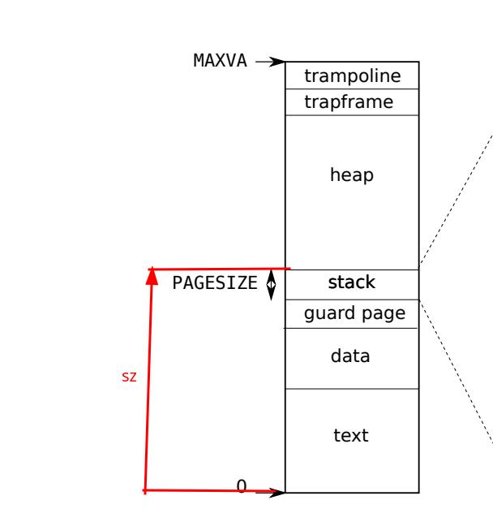

# mmap
## mmap机制
根据`man`，mmap机制有两个函数
```c
void *mmap(void addr[.length], size_t length, int prot, int flags,int fd, off_t offset);
int munmap(void addr[.length], size_t length);
```
它的作用是将文件的内容映射到一块内存中。`addr`可以作为内核选择地址的一个提示，`length`是映射的长度，`prot`是保护模式，`flags`是标志位，`fd`是文件描述符，`offset`是文件偏移量

## 本实验只要求实现一部分mmap功能
### mmap
- `addr`只能为`0`，即内核自己选择地址进行映射
- `prot`只能是`PROT_READ`和`PROT_WRITE`的组合
- `flags`要么是`MAP_PRIVATE`，要么是`MAP_SHARED`
- `MAP_SHARED`不必使用同一个物理页，也就是无法利用mmap实现进程间通信
- `off`为`0`，即不支持从文件中间某个位置开始映射
### munmap
释放映射的内存时，不能在映射的内存中间释放，要么头对齐，要么尾对齐，或者全部释放  
即：**不能打洞**

## 测试驱动开发
linux内核的mmap机制比较复杂，本实验只需要实现`mmaptest`中测试的功能即可  
测试的功能有
- 映射内存的内容与文件内容一致
- 能够从以只读方式打开的文件映射出私有的可写的内存
- 不能写一个以只读方式打开的文件映射出的共享的内存
- 能够读写一个可读可写方式打开的文件映射出的共享的内存
- 在文件关闭后，mmap映射的内存仍然可用
- `munmap`共享的内存后，修改被写回文件
- 能够同时映射两个文件
- `fork`产生的子进程获得父进程的映射

此外，`usertests`中也有一些测试点，在没有`mmap`的情况下能够通过  
要求这些功能在实现了`mmap`后仍然能够通过
例如
- 不能读写`MAXVA`以上的地址
- 没有内存泄露
- 能够使用`sbrk`

## 思路
### 如何选择地址
#### VMA
根据实验指导的建议，使用`VMA`记录进程的虚拟地址空间，其基本结构有`start`表示地址起始位置，`length`表示长度  
通过这种方式，能够记录进程的虚拟地址空间的使用情况，就能够选择一个合适的地址进行映射，也能够释放映射的内存
### 如何组织VMA
#### 失败的尝试
我最开始是使用一个链表组织VMA，VMA需要记录进程除了`trampoline`和`trapframe`之外的所有内存使用情况，包括栈，代码等  
##### VMA的分配与释放
xv6内核没有内存分配器，只能分配页面，所以我通过声明一个数组
```c
struct vmt vmtable[16 * 64];
```
来获得一个`vmt`的一个池，每次需要一个`vmt`，就从池中取出一个，需要释放时，就放回池中
##### 缺点

1. 最大的缺点就是，它和进程的`sz`字段是冲突的。
    `sz`指示一个进程的代码，静态数据，堆栈的大小总和，也就是说，xv6在实现`sbrk`时充分利用了`sz`，分配的内存
    是从低到高连续分配的。而上述方案也会在低地址处分配内存，这样就会和`sbrk`分配的内存冲突。  
    解决方法是，删掉`sz`字段，完全采用`vmt`管理内存，修改`sbrk`的实现。但是这样对原来的代码的改动太多
2. 链表操作比较繁琐
#### 更好的方案
在PCB中放入一个固定长度的`vmt`的数组，只用来记录`mmap`机制使用的内存的情况，同时`mmap`分配内存时从高地址开始分配
#### 可行性分析
- 进程的代码，静态数据都在低地址上连续存放的，`sbrk`也是从低地址开始分配的，也就是说，进程的**扩张**(或**堆的生长**)是从低到高连续的  
而mmap分配内存时，从`MAXVA`从高到低分配，这样就不会和进程的扩张冲突
- 一个进程能够打开的文件的数量是有限的，所以一个进程使用固定长度的数组`vmt`是没有问题的
### 懒分配/延迟分配
进程映射的文件的大小可能比物理内存还要大，进程也有可能映射一个大文件而只使用其中一部分，为了更好的性能，使用延迟分配策略，
将映射的内存的分配从`mmap`调用时延迟到进程访问这块内存时  
在调用`mmap`时，只记录在`vmt`中，所以返回的地址是用户地址空间内不合法的地址  
当进程访问这个地址时，会触发`store fault`或`load fault`，捕获这种异常，完成映射的内存的分配  
采用这种方案，每次只能分配一页映射的内存
### 何时写回文件
只有使用了`MAP_SHARED`才会写回，写回发生在`munmap`时（实验不要求实现`msync`）  
当然进程也可能不释放映射内存而退出，所以在进程退出时，需要做`munmap`的工作，也可能发生写回  
如果使用了`MAP_PRIVATE`，对映射的内存的修改不会写回，此时`mmap`的效果相当于将文件加载到内存
### `Dirty bit`
`Sv39`规定页表项的第`7`位是`dirty bit`，当通过页表修改了这一页时，硬件自动置位  
利用硬件提供的特性，可以在释放映射的内存时，只写回修改过的页，提高性能  
本实验不要求实现这个功能
### 如何让子进程继承父进程的映射内存
只需要复制父进程的`vmt`表，并增加文件的引用计数即可
#### 关于引用计数
xv6的`file`有引用计数，`inode`（磁盘上的inode对象加载到内存后形成的结构）也有引用计数  
`file`是对各种资源，包括文件的抽象，而`inode`对应磁盘上的文件  
当进程调用`dup`时，实际上只是增加了`file`的引用计数，而`inode`的引用计数没有变化  
当进程关闭文件时，只是减少了`file`的引用计数  
当`file`的引用计数为`0`时，才会真正关闭它**underlying**的资源，例如`inode`，`pipe`等  
而`inode`的关闭也只是减少引用计数，当`inode`的引用计数为`0`时，标志这个`inode`是空闲的，可以被覆盖
### 进程退出时清理资源
进程推出时，需要释放映射的内存并可能写回文件，然而，进程有可能使用`mmap`映射了一个文件，但是没有使用  
因为采用了延迟分配的策略，此时，进程的`vmt`表有记录，但是没有对应的页，需要选择性的释放那些被分配的页  
对应没有分配映射的内存的文件内容，也不需要写回
